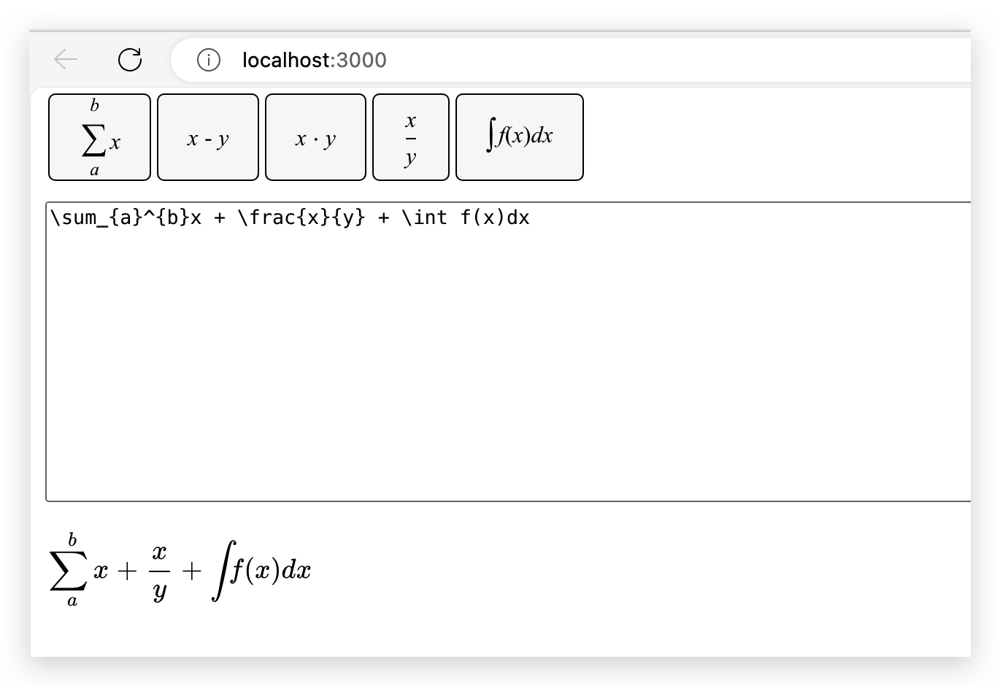

# 一个简单的LaTeX公式辅助工具



## Introduction

This project is a simple tool to help you write LaTeX formulas.
It's built with React.js

### Import JavaScript Library

```html
<script src="/path/to/cdn/this/project/js/file"></script>
```

### Usage

```html
<script>
    window.onload = function () {
      window.LaTeXBuilder('root', function(text) {
        console.log(text); // click the button of LaTeX-tools UI to get the formula
      });
    };
  </script>
```

>[!IMPORTANT]
> The project is one part of FlyLaTeX.

- [x] use local KaTeX css and fonts resources

## Other

This project was bootstrapped with [Create React App](https://github.com/facebook/create-react-app).

## Available Scripts

In the project directory, you can run:

### `npm start`

Runs the app in the development mode.\
Open [http://localhost:3000](http://localhost:3000) to view it in your browser.

The page will reload when you make changes.\
You may also see any lint errors in the console.

### `npm test`

Launches the test runner in the interactive watch mode.\
See the section about [running tests](https://facebook.github.io/create-react-app/docs/running-tests) for more information.

### `npm run build`

Builds the app for production to the `build` folder.\
It correctly bundles React in production mode and optimizes the build for the best performance.

The build is minified and the filenames include the hashes.\
Your app is ready to be deployed!

See the section about [deployment](https://facebook.github.io/create-react-app/docs/deployment) for more information.